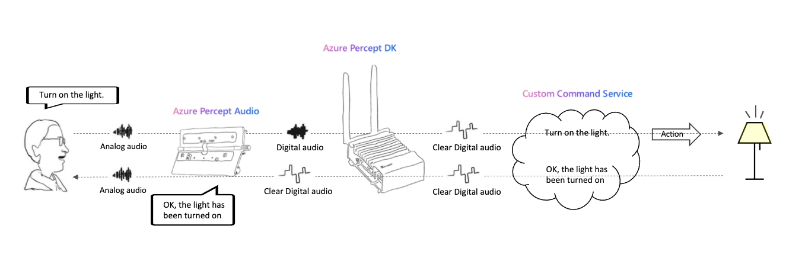
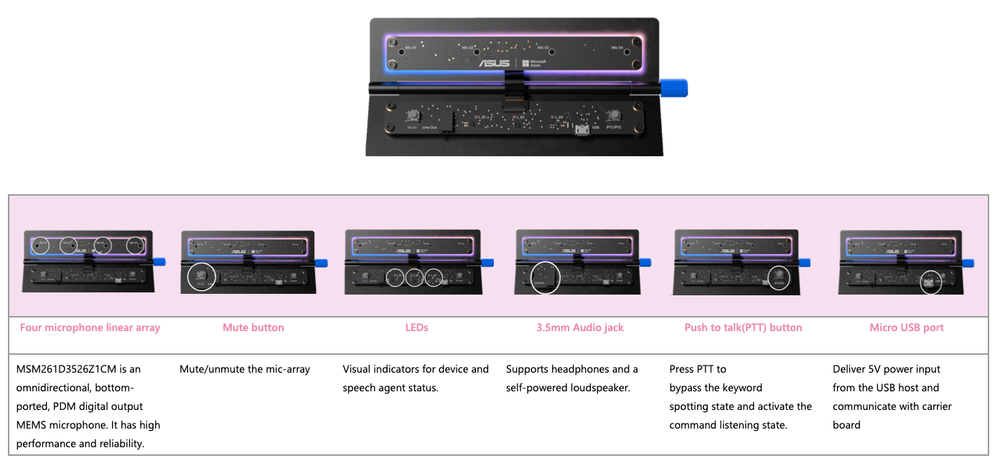

# smart-plug-with-custom-commands
Voice control the smart appliance using the Percept DK hardware, TP-Link kasa sdk, and Custom Commands platform

The goal of this project is to be able to vocie control the smart appliance with the Percept DK device and Audio SoM using Azure Custom Commands as the platform.

## Prerequisites
- Percept DK ([Purchase](https://www.microsoft.com/en-us/store/build/azure-percept/8v2qxmzbz9vc))
- Azure Subscription : [Free trial account](https://azure.microsoft.com/en-us/free/)
- An Azure subscription key for Speech service: [Get one for free](https://github.com/MicrosoftDocs/azure-docs/blob/master/articles/cognitive-services/Speech-Service/overview.md#try-the-speech-service-for-free) or create it on the [Azure portal](https://portal.azure.com/)
- An Azure Container Registry repository or create it by following [here](https://docs.microsoft.com/en-us/azure/iot-edge/tutorial-develop-for-linux?view=iotedge-2020-11#create-a-container-registry)
- Docker for image building
- A Custom Commands app (create custom commands [here](https://ms.portal.azure.com/#create/Microsoft.CognitiveServicesSpeechServices))
- TPLink Smart Plug ([Purchase](https://www.kasasmart.com/us/products/smart-plugs/kasa-smart-wifi-plug-hs100))
- Download the TP-LINK Kasa app [Download on the App Store](https://apps.apple.com/us/app/kasa-smart/id1034035493)/ [Get it on Google Play](https://play.google.com/store/apps/details?id=com.tplink.kasa_android&hl=en_US&gl=US)

## How does voice assistance work?

## Core components of the Azure Percept Audio

## Solution Architecture

## Device setup
1. Follow [Quickstart: unbox and assemble your Azure Percept DK components](https://docs.microsoft.com/en-us/azure/azure-percept/quickstart-percept-dk-unboxing) and the next steps.

## Content

| File             | Description                                                   |
|-------------------------|---------------------------------------------------------------|
| `readme.md`             | This readme file                                              |
| `deployment.template.json`    | The delopyment the edge modules of this Smart Plug Solution |
| `envtemplate`    | The list of the enviroment varialbes for .env use |

## Steps
1. Visit the [custom commands folder](https://github.com/leannhuang/smart-plug-with-custom-commands/tree/main/custom-commands) to complete setting up the custom commands of the smart plug (Note down the `Application ID`, `Speech resource key`, and `region`)
2. Configure Smart Plug preferences on the Kasa app to get smart plug LAN ip and note it down
3. Create a file named `.env` in this folder based on `envtemplate`. Provide values for all variables.
4. Visit the [PlugModule folder](https://github.com/leannhuang/smart-plug-with-custom-commands/tree/main/modules/PlugModule) to deploy edge modules on your edge device

### Credits and references
- [TPLink Smart Home api](https://github.com/plasticrake/tplink-smarthome-api)
- [Azure Percept documentation](https://docs.microsoft.com/en-us/azure/azure-percept/)
- [Develop Custom Commands applications](https://docs.microsoft.com/en-us/azure/cognitive-services/speech-service/how-to-develop-custom-commands-application)
- [Object Counting on the Percept DK with Azure Video Analyzer](https://github.com/michhar/counting-objects-with-azure-video-analyzer)
- [Create a voice assistant using Custom Commands](https://github.com/MicrosoftDocs/azure-docs/blob/master/articles/cognitive-services/Speech-Service/quickstart-custom-commands-application.md)
- [Azure Percept Youtube channel](https://www.youtube.com/channel/UCa8_TsUuotIMuzkLzGNQPIg/featured)
