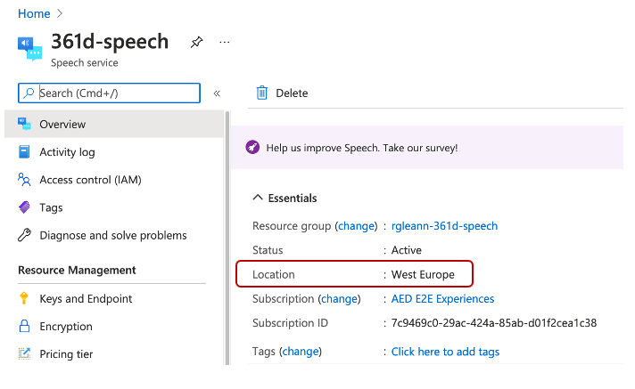
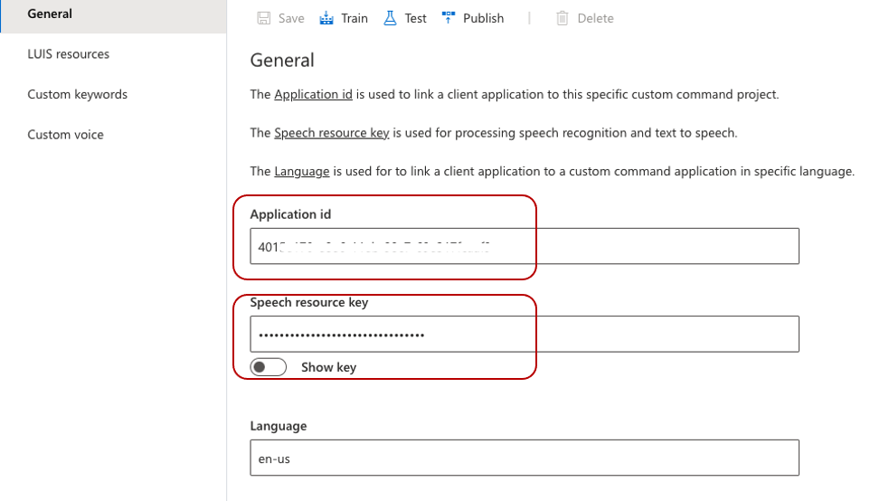

# Custom Commands Deployment
Use this folder to deploy smart plug custom commands on your speech studio

## Content
| File             | Description                                                   |
|-------------------------|---------------------------------------------------------------|
| `smart-plug.json`       | The configuration of the smart plug custom commands           |
| `readme.md`     | This readme file   |

## Domain
This Custom Commands application hosts some basic commands to fulfil the turning On/Off the light

## Example sentences
Here are a few examples. Try these or others of your choice:

```
Turn on the light
Turn off the light
```

## Deploy and note down the `Application ID`, `Speech resource key`, and `Region` value

1. Follow the guidance [here](https://github.com/MicrosoftDocs/azure-docs/blob/master/articles/cognitive-services/Speech-Service/quickstart-custom-commands-application.md#go-to-the-speech-studio-for-custom-commands) to import the `smart-plug.json` file, note down the `region` of the resource you created above for further use   



1. Try out some voice command [here](https://github.com/MicrosoftDocs/azure-docs/blob/master/articles/cognitive-services/Speech-Service/quickstart-custom-commands-application.md#go-to-the-speech-studio-for-custom-commands)

2. Update prediction LUIS resource [here](https://github.com/MicrosoftDocs/azure-docs/blob/master/articles/cognitive-services/Speech-Service/quickstart-custom-commands-application.md#update-prediction-luis-resource)

3. Publish the application [here](https://github.com/MicrosoftDocs/azure-docs/blob/master/articles/cognitive-services/Speech-Service/quickstart-custom-commands-application.md#publish-the-application)

4. Note down the `Application ID` and `Speech resource key` for further use



## Credits and references
- [Create a voice assistant using Custom Commands](https://github.com/MicrosoftDocs/azure-docs/blob/master/articles/cognitive-services/Speech-Service/quickstart-custom-commands-application.md#publish-the-application) 